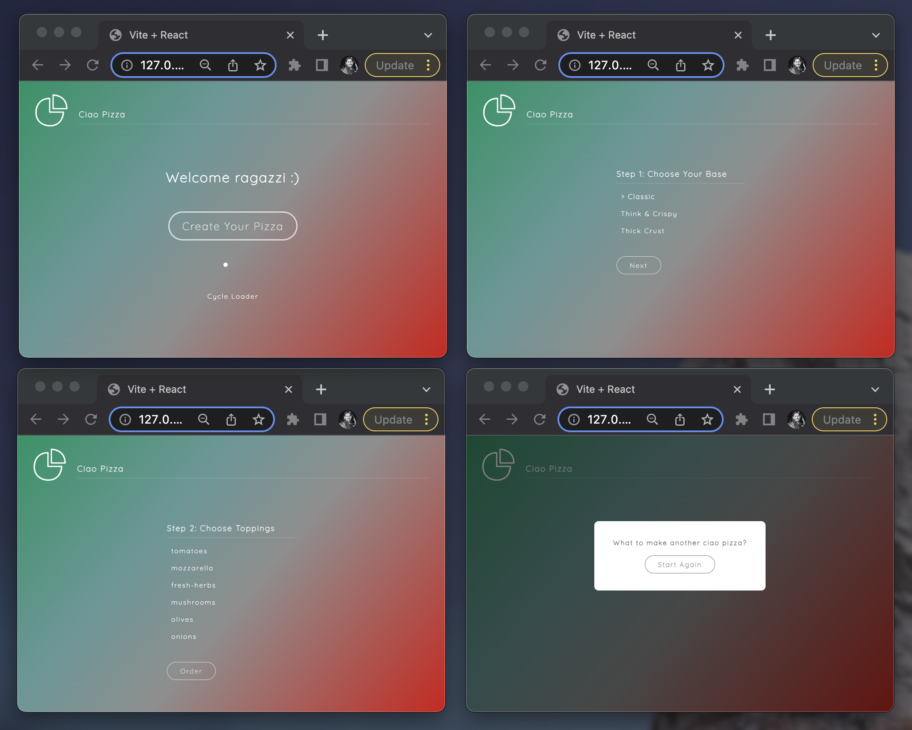

## Ciao Pizza (with Framer motion)

> A sandbox explaining the use of **Framer Motion** in each routed React component.



Featuring:

- This is a [React.js](https://reactjs.org/) app deployed with `create vite`.
- We switch `<Route />` paths to React components with [React Router](https://reactrouter.com/).
- The main demonstration in this sandbox app, is the use of [Framer Motion](https://www.framer.com/motion/).
- `AnimatePresence` allows you to animate components when they're removed from the React tree. It allows components to animate out when unmounting. `AnimatePresence` requires a `exit` prop enabled for animations. Because React lacks a lifecycle method that:

1. Notifies components when they're going to be unmounted and...
2. Allows them to defer that unmounting until the operation/animation is complete.

- But `AnimatePresence` has a bit more complexity when we route and switch components and unmount from the DOM. To get it to `exit` work, the `<Switch />` needs props regarding the path location. See comments made in the `App.jsx` file that has `AnimatePresence` configured that is more complex compared to our `Model.jsx`.

- And framer **variant** 🧬 objects are supplied to most React components. See comments made in the `Base.jsx` file.

1. We get to extract our initial & animate object(s) into a single outside variant object. We can then reference to that outside variant object, keeping our JSX code cleaner.
2. We can then propagate these variant(s) or changes to them, throughout the DOM tree resulting in cleaner code also.
3. The bigger advantage is that variants allow timing-relationships between parent, and their directly/enclosed children `motion` elements throughout the tree your variant encloses over.

- With variants we get orchestration between parent `motion` and child `motion` components. By default, all animations will start simultaneously. But by using variants, we gain access to extra transition props like `when`, `delayChildren`, and also the `staggerChildren`, that lets parent `motion` components to orchestrate execution of child `motion` component animation. See comments made in the `Order.jsx` file.

- We make use of **Keyframes** in our variants also. See `Home.jsx` and `Loader.jsx` for more information.

Dependencies:

```json
"dependencies": {
  "framer-motion": "^7.6.1",
  "react": "^18.2.0",
  "react-dom": "^18.2.0"
}
```

Regards, <br />
Luigi Lupini <br />
<br />
I ❤️ all things (🇮🇹 / 🛵 / ☕️ / 👨‍👩‍👧)<br />
